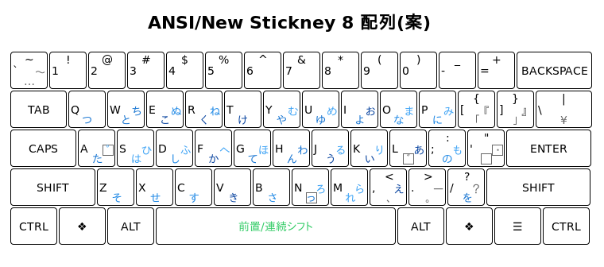

# New Stickney かな配列

実験中の New Stickney かな配列のリポジトリです。Windows で New Stickney かな配列を使用するための AutoHotKey スクリプトを提供しています。

## 概要

New Stickney 配列は現行のJISかな配列の元となったバーナム・スティックニーさんが考案されたかな配列の、

* 濁点の付く仮名は左手側に、濁点はその反対側に配置する、
* 仮名はなるべく行ごとにまとめて配置する、

という原則を尊重しつつ、かな文字を3段10列にまとめた、かな配列です。特に日本人にとって覚えやすい、かな配列となるように注意しています。

現在の New Stickney 配列は、上記の2点に加えて、

* 小書きキー方式、
* 新JIS配列で考案されたセンターシフト方式、

を採用しています。

小書きキー方式では、<ゃゅょ>といった小書き文字は、<やゆよ>を打鍵した後に[゛]キー押すことで入力します。この方式は、携帯電話などでの文字入力方式としては既に馴染み深い方式です。

センターシフト方式では、シフト面の文字を入力するときには、まずスペースバーを単独で押し、続いて対応する文字キーを押します。スペースバーと文字キーを同時に押す必要はありません。ただし、シフト面の文字を連続して入力したい場合は、スペースバーを押したままにしても構いません(前置・連続シフト方式)。

配列の[性能面](https://esrille.github.io/keyboard-layout-comparison/)では、

* スティックニーの配列並の覚えやすさ、
* 新JIS配列並の打鍵効率、
* 月配列2-263程度のローリング打鍵率、

といった傾向が見られます。

New Stickney かな配列は、物理的なキー配置としては英語圏に限らず今日世界中で広く使われている英語キーボードのキー配置での利用を想定しています。

## AutoHotKey スクリプトの使用方法

まず[AutoHotkey](http://ahkscript.org/) 1.1.* (従来 AutoHotkey_L と呼ばれていたもの)をインストールしてください。続いて、ahk/NewStickney.ahk スクリプトを実行すると、New Stickney かな配列を Windows で使用できるようになります。

* スクリプトは、Windows10とMicrosoft IMEの組み合わせで動作を確認しています。
* IMEの制御には、[Autohotkey IME制御用 関数群 (コピペ/組込用)(IME.ahk)](http://www6.atwiki.jp/eamat/)を利用させていただいています。

### NewStickney.ahk スクリプト

* NewStickney.ahk スクリプトは英語(ANSI)キーボード用です。
* IMEのオンとオフは、それぞれ右ALTと左ALTに割り当てています。また右ALTは日本語入力中は空白(変換)キーとして使えるようにしてあります。

### x6004.ahk スクリプト

* ahk/NewStickney.ahk スクリプトの代わりに ahk/x6004.ahk を実行すると、新JIS配列(センター，前置・連続シフト方式)を使用できるようになります。
* x6004.ahkはJISキーボード用です。
* 日本語入力中は、変換キーが空白キーになります。
* Shift-0で_(アンダースコア)を入力できます。

## リンク

* [New Stickneyの開発状況](https://twitter.com/hashtag/newstickney?f=tweets&vertical=default&src=hash)

