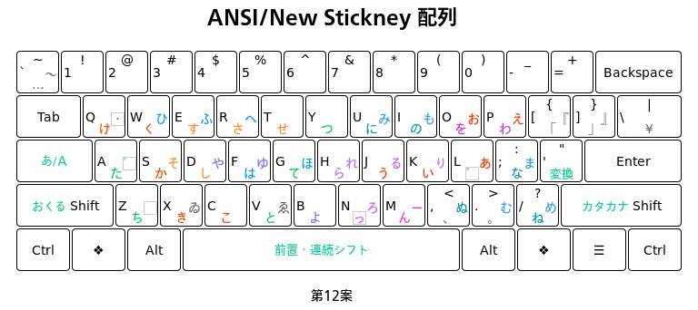

# New Stickney かな配列

WindowsでNew Stickneyかな配列を使用するためのAutoHotKeyスクリプトを提供しています。

※ 現在、New Stickneyかな配列の研究開発は、あたらしい日本語入力IME「[日本語 漢字置換インプット メソッド for IBus](https://github.com/esrille/ibus-replace-with-kanji)」をつかってすすめています。FedoraやUbuntuなどIBusに対応したOSを利用されている場合は、日本語 漢字置換インプット メソッド for IBusをつかって、最新のNew Stickneyかな配列を利用できます。

## 概要

New Stickney配列は現行のJISかな配列のもととなったバーナム・スティックニーさんが考案されたかな配列の、

* 濁点のつくかな文字は左手側に、濁点はその反対側に配置する、
* かな文字はなるべく行ごとにまとめて配置する、

という原則を尊重しつつ、かな文字を3段10列にまとめた、あたらしいかな配列です。特に日本人にとっておぼえやすい、かな配列となるように注意しています。

現在のNew Stickney配列は、上記の2点にくわえて、

* 小がきキー方式、
* 新JIS配列で考案されたセンターシフト方式、

を採用しています。

小がきキー方式では、「ゃゅょ」の「ゃ」といった小がき文字は、「や」を打鍵したあとに[゛]キーおして入力します。この方式は、携帯電話などでの文字入力方式として、すでになじみぶかい方式です。

センターシフト方式では、シフト面の文字を入力するときには、まずスペースバーを単独でおし、つづいて対応する文字キーをおします。スペースバーと文字キーを同時におす必要はありません。ただし、シフト面の文字を連続して入力したい場合は、スペースバーをおしたままにしてもかまいません(前置・連続シフト方式)。

配列の[性能面](https://esrille.github.io/keyboard-layout-comparison/)では、

* スティックニーの配列並の覚えやすさ、
* 新JIS配列並の打鍵効率、
* 月配列2-263程度のローリング打鍵率、

といった傾向が見られます。

New Stickneyかな配列は、物理的なキー配置としては英語圏にかぎらず今日世界中でひろくつかわれている英語キーボードのキー配置での利用を想定しています。

※ 最新の小学生むけの[説明書](https://esrille.github.io/ibus-replace-with-kanji/layouts.html)もあわせて参照してください。

## AutoHotKey スクリプトの使用方法

まず[AutoHotkey](http://ahkscript.org/) 1.1.* (従来 AutoHotkey_L とよばれていたもの)をインストールしてください。つづいて、ahk/NewStickney.ahk スクリプトを実行すると、New Stickney かな配列を Windows で使用できるようになります。

* スクリプトは、Windows10とMicrosoft IMEの組み合わせで動作を確認しています。
* IMEの制御には、[Autohotkey IME制御用 関数群 (コピペ/組込用)(IME.ahk)](http://www6.atwiki.jp/eamat/)を利用させていただいています。

### NewStickney.ahk スクリプト

* NewStickney.ahk スクリプトは英語(ANSI)キーボード用です。

### x6004.ahk スクリプト

* ahk/NewStickney.ahk スクリプトのかわりに ahk/x6004.ahk を実行すると、新JIS配列(センター，前置・連続シフト方式)を使用できるようになります。
* x6004.ahkはJISキーボード用です。
* 日本語入力中は、変換キーが空白キーになります。
* Shift-0で_(アンダースコア)を入力できます。

## これまでの案

* [第12案](https://esrille.github.io/new-stickney/new-stickney12.html) (最新)
* [第11案](https://esrille.github.io/new-stickney/new-stickney11.html)
* [第10案](https://esrille.github.io/new-stickney/new-stickney10.html)
* [第9案](https://esrille.github.io/new-stickney/new-stickney9.html)
* [第8案](https://esrille.github.io/new-stickney/new-stickney8.html)

## リンク

* [New Stickneyの開発状況](https://twitter.com/hashtag/newstickney?f=tweets&vertical=default&src=hash)

